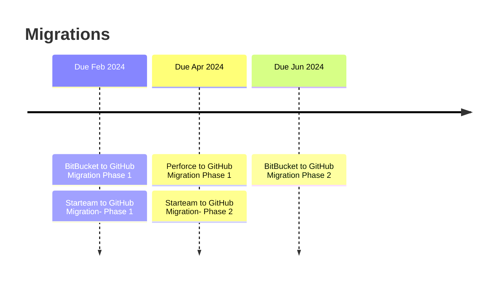

# Statement of Work (SOW)

## Starteam to Github Migration - {Phase-1}

### I. Project Overview

This Statement of Work (SOW) outlines the scope, objectives, and deliverables for the migration of an existing Starteam repository to Github. The migration project aims to transfer all relevant data and maintain data integrity, including Large File Storage (LFS), commits, tags, releases, change sets, history, pull requests, and artifacts from day 1 of the source repository.

### II. Scope of Work

1. **Scope of Starteam Instances**
    - Starteam Instance 1 - 41 Repos
    - Starteam Instance 2 - 2 Mono Repos with aprox 100 main parent folders
      
2. **Phases of Migration**
   - Onboarding phase [Prior to the formal kickoff of this engagement]
     - Access to Github and Starteam to Arctiq team
     - Documentaion and knowledge transfer on details of current GitHub environment
     - POC details from starteam, Devtools team
     - Have a clear understading from Starteam POC's on the Data and design the data Migration.
     - Suggestions on the best practices and decision sign-off
       
   - POC and Sample test repo Migration phase
     - Identify few test Repos from POC's and Migrate
     - No gaps are identified with the requirements of scope defined
     - sign-off from POC's and Devtools teams.
       
   - Production Migration phase
     - Migrate all the repos to GitHub which are defined on the scope.
     - No gaps are identified with the requirements of scope defined
     - sign-off from POC's and Devtools teams.
       
   - Handover phase
     - Knowledge transfer to Devtools team with all the documentations.
     - sign-off from Devtools team.
   
3. **Data Assessment and Planning**
   - Conduct a comprehensive analysis of the existing Starteam repository to identify all relevant data, including **users,permissions,LFS objects, commits, tags, releases, change sets, history,issues, pull requests, and artifacts**.
   - Define the migration strategy based on the assessment, ensuring minimal downtime and data loss.
   - Mandate to migrate History of **users,permissions,LFS objects, commits, tags, releases, change sets, history,issues pull requests, and artifacts**.

4. **Migration Strategy**
   - Develop a **detailed migration plan**, specifying the sequence of migration tasks, dependencies, and estimated timelines.
   - Ensure that the migration strategy is designed to handle LFS data efficiently.

5. **Data Extraction**
   - Extract all data, including Users, Permissions, LFS objects, commits, tags, releases, change sets, history, pull requests, artifacts and not limited to list from the Starteam repository.

6. **Data Transformation and Formatting**
   - Transform and format the extracted data to align with Github's structure and requirements, including maintaining commit history and relationships.

7. **Data Migration**
   - Migrate all data to the designated Github repository.
   - Ensure that all users, permssions, commits, tags, releases, change sets, history,issues, pull requests, and artifacts are accurately transferred.

8. **Large File Storage (LFS) Migration**
   - Ensure that all LFS objects are migrated, preserving their integrity and ensuring their proper tracking within Github LFS.

9. **Quality Assurance and Testing**
   - Conduct thorough testing to validate the migration process.
   - Verify that all data, including LFS, has been successfully migrated.
   - Address any issues or discrepancies identified during testing.

10. **Data Verification and Validation**
   - Collaborate with the client's team to verify the migrated data's accuracy and completeness.

11. **Training and Knowledge Transfer**
   - Provide training and documentation to the client's team on managing the migrated repository in Github.

11. **Documentation and Reporting**
    - Maintain detailed records of the migration process and provide a comprehensive migration report.

12. **Post-Migration Support**
    - Offer post-migration support to address any issues or questions that may arise after the migration.

### III. Deliverables

1. Detailed Migration Plan (Objectives, dependencies, Risks, Milestones and Timelines)
2. 5 Test starteam repos migration and sign -off from POC 
3. Extracted and Transformed Data
4. Migrated Github Repository with all data
5. Testing and Validation Reports
6. Training and Run Book Documentation
7. Comprehensive Migration Report
8. Post-Migration Support

### IV. Change Control Process

### V. Timeline

The project timeline will be defined in the detailed migration plan, considering the size and complexity of the Starteam repository. The goal is to ensure a smooth transition with minimal disruption.

### VI. Terms and Conditions

The terms and conditions of this SOW, including payment terms, project management, and responsibilities.

1. **Pricing**
   |Services|Amount|
   |--------|-------|
   |Starteam to Github Migration| xxxx|
   
     - **Payments Terms w.r.t Starteam to GitHub Migration**
       
       |Milestone|Acceptance Criteria|Invoice Amount|
       |---------|-------------------|--------------|
       |Scope Sign-off| Detailed Migration Plan , Test repos sign-off | 15% of Amount|
       |50% of repo Migration| Migrated Github Repository with all data including History,Testing and Validation Reports , Migration report| 35% of Amount|
       |100% of repo Migration|  Migrated Github Repository with all data including History,Testing and Validation Reports , Migration report| 35% of Amount|
       |Handover|Handover of Migration scripts, Run Books and knowledge transfer|15% of Amount|
       
### VII Time Line

### VIII. SOW Approval
This SOW shall only be valid if signed by both parties hereto. This SOW and any CR may be signed in separate counterparts, each of which shall be deemed an original and all of which together will be deemed to be an original. Any electronic signatures are deemed the equivalent of handwritten signatures. The terms set out are acceptable and agreed to by the undersigned.

- Party 1

- Party 2
  
---

This Statement of Work outlines the key elements for migrating a Starteam repository to Github, including LFS, commits, tags, releases, change sets, history, pull requests, and artifacts. 
